<!--more-->

## 2026-03

### 所以到底成什么像 😯

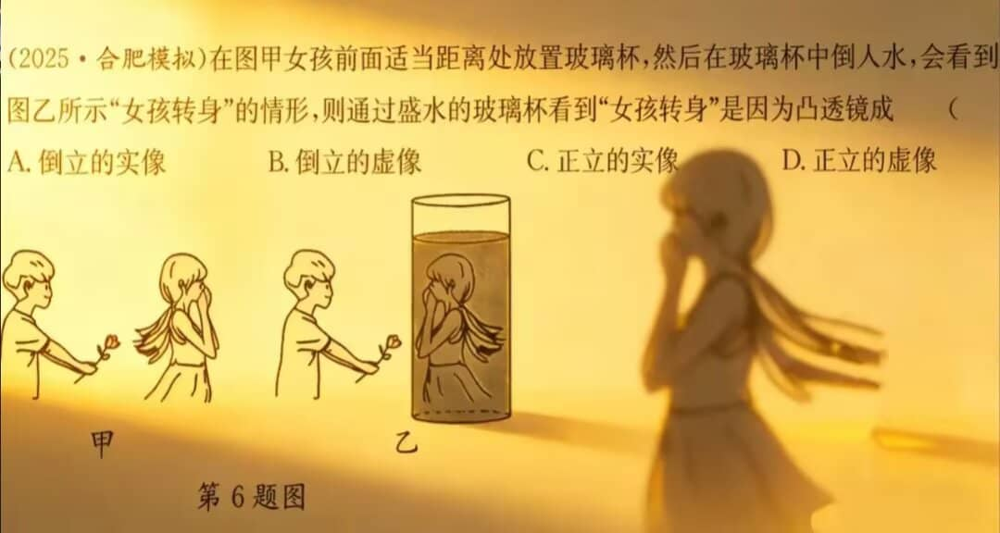

---

### 如同昨夜天光乍破了远山的轮廓



---

## 2025

### Country Lode,Take me home:天涯共此石

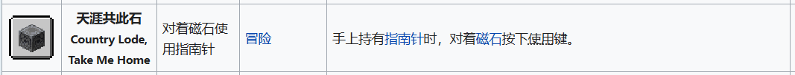

---

### 不是烟斗的烟斗

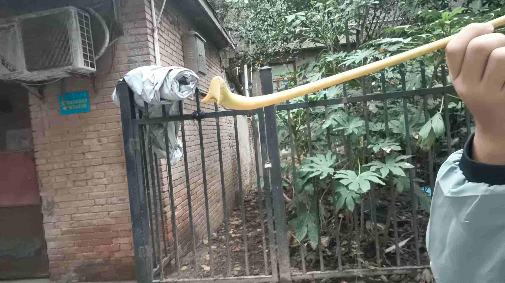

---

### 照进宿舍的夕阳

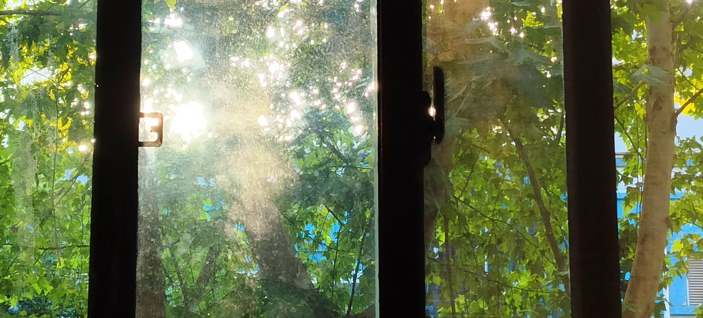

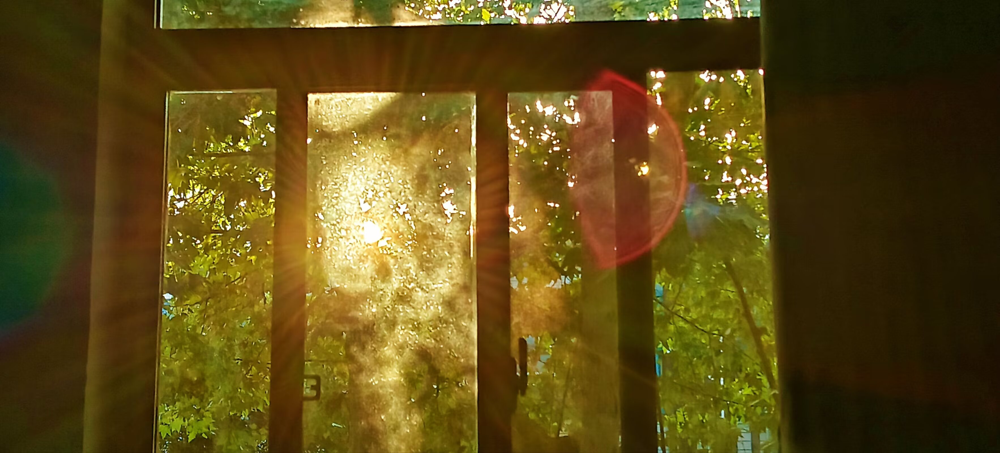

---

### 赤橙黄绿青蓝紫

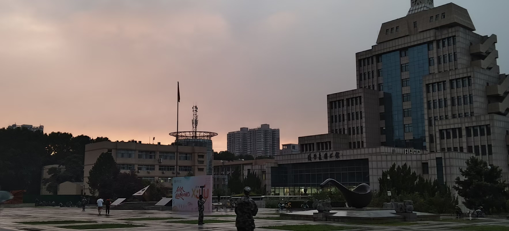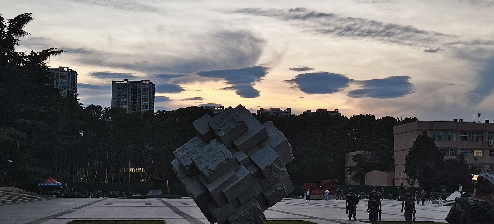

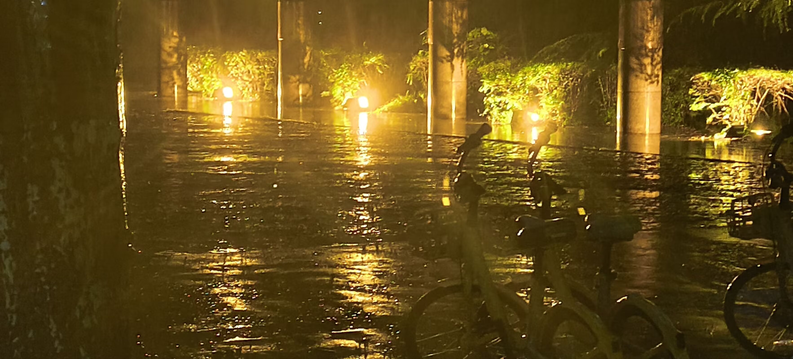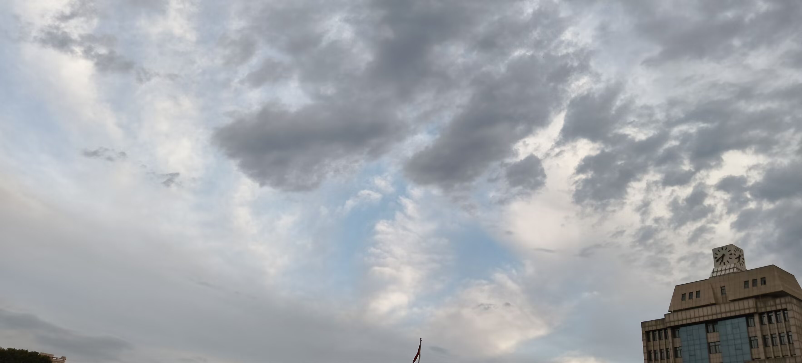

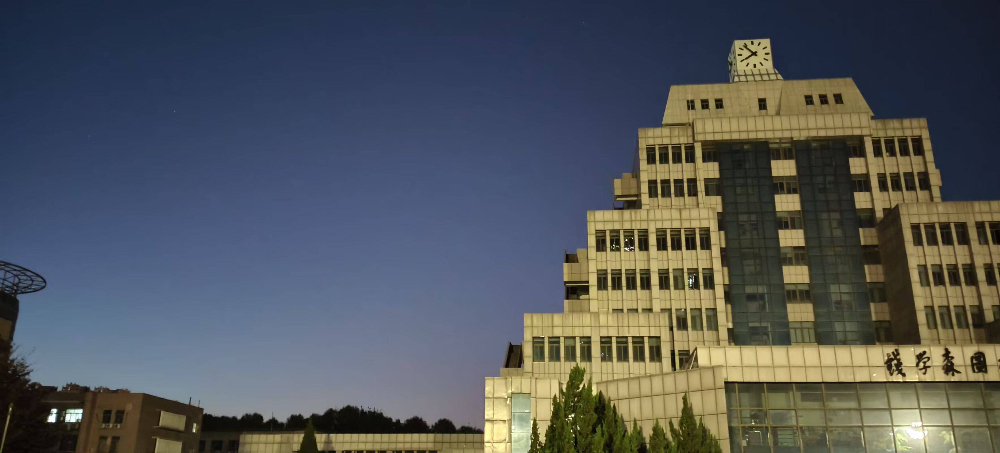

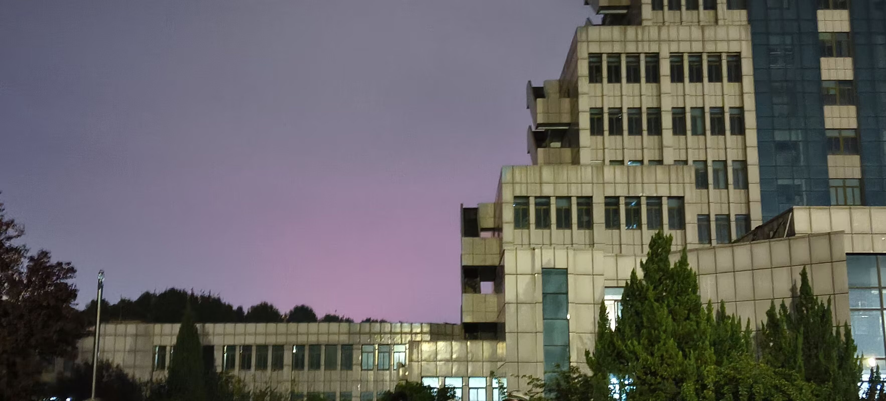

---

### 老家的一角

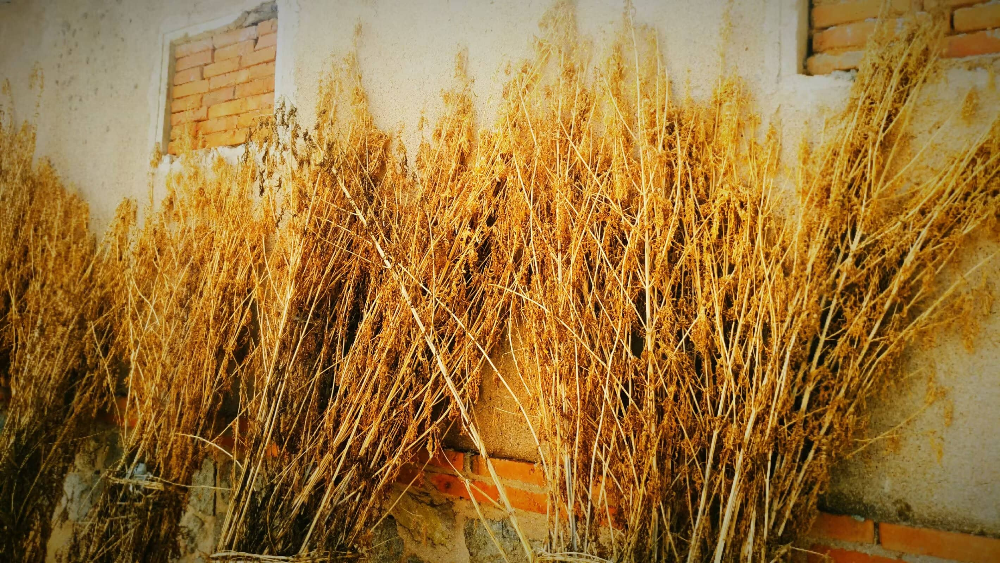

---

> " 世界上并不缺少美，而是缺少发现美的眼睛。 "
>
> —— *奥古斯特 · 罗丹*

---
